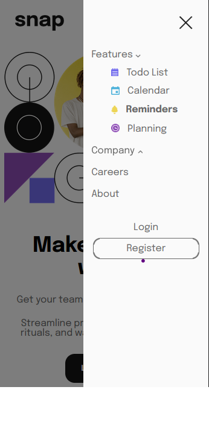

# React Dropdown Navigation App.

This is a solution to the [Intro section with dropdown navigation challenge on Frontend Mentor](https://www.frontendmentor.io/challenges/intro-section-with-dropdown-navigation-ryaPetHE5). I've developed it using <bold>React + Typescript</bold>
