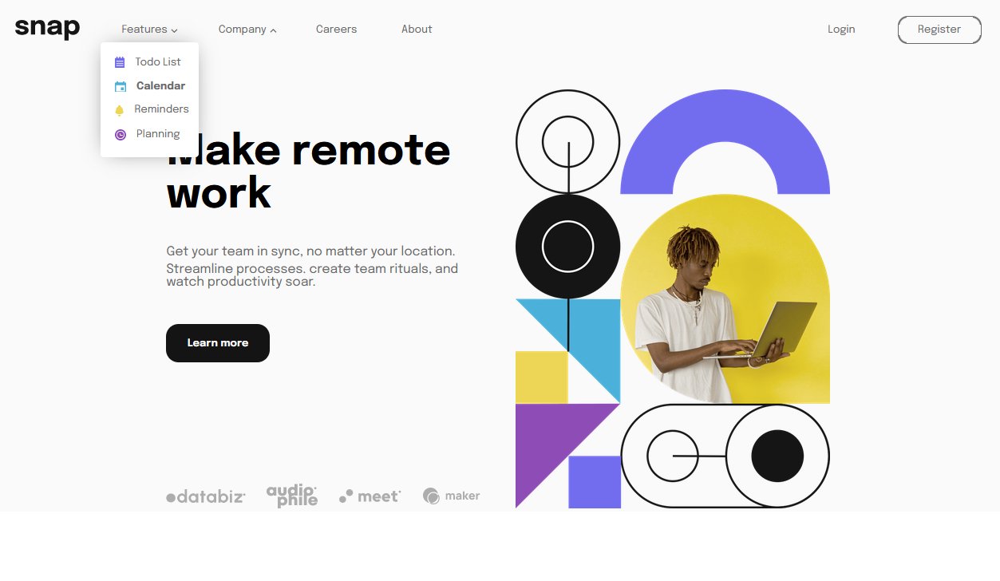

# React Dropdown Navigation App.
  This is a solution to the [Intro section with dropdown navigation challenge on Frontend Mentor](https://www.frontendmentor.io/challenges/intro-section-with-dropdown-navigation-ryaPetHE5). I've developed it using React + Typescript.
  It has a responsive layout, plus an interactive drop-down navigation list, that changes its design depending on window size. 

